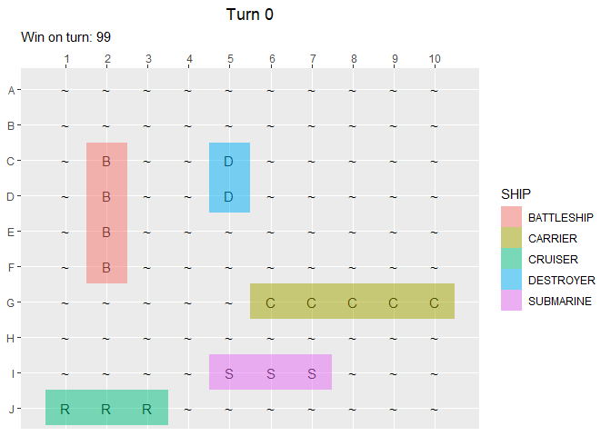
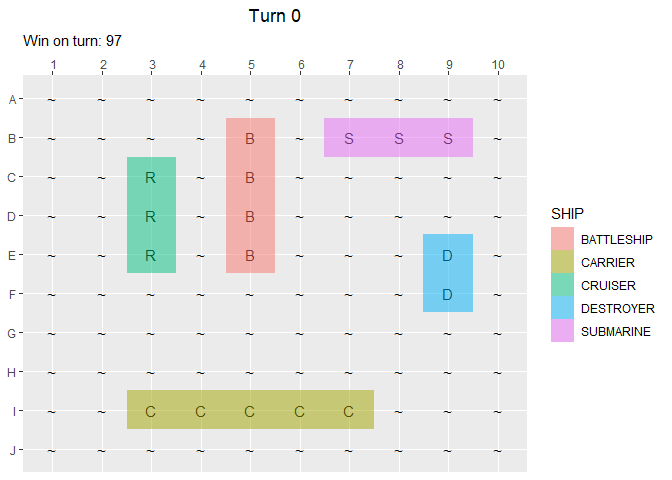

Packages used:

    library(pacman)
    p_load(tidyverse,gganimate)

Today, we set out to apply our R programming skills to a childhood board
game: Battleship. Let us begin our task by creating a simplistic version
of the game, catered to the notebook format of its presentation.

Given the inability of a viewer to interact with our code, we will
represent the game through a single board, with ships randomly placed,
and provide an algorithm for the computer to guess various positions.

Our first step will be to create a game board with no ships on it. We
can do this via the code below:

    board <- data.frame(matrix("~", nrow = 10, ncol = 10))
    colnames(board) <- seq.int(1,10)
    rownames(board) <- LETTERS[seq.int(1,10)]
    board

    ##   1 2 3 4 5 6 7 8 9 10
    ## A ~ ~ ~ ~ ~ ~ ~ ~ ~  ~
    ## B ~ ~ ~ ~ ~ ~ ~ ~ ~  ~
    ## C ~ ~ ~ ~ ~ ~ ~ ~ ~  ~
    ## D ~ ~ ~ ~ ~ ~ ~ ~ ~  ~
    ## E ~ ~ ~ ~ ~ ~ ~ ~ ~  ~
    ## F ~ ~ ~ ~ ~ ~ ~ ~ ~  ~
    ## G ~ ~ ~ ~ ~ ~ ~ ~ ~  ~
    ## H ~ ~ ~ ~ ~ ~ ~ ~ ~  ~
    ## I ~ ~ ~ ~ ~ ~ ~ ~ ~  ~
    ## J ~ ~ ~ ~ ~ ~ ~ ~ ~  ~

Next, lets create a function for creating ships. In the future we might
combine all 5 ships into a single function, but for now we will split
them up. We begin with the first ship: the Carrier.

    carrier_fun <- function(){
      #orientation determines the direction of a ship's placement
      orientation <- unlist(sample(c('horizontal','vertical'),1))
      
      
      #change_pos will be a vector of 5 numbers designating a ship's position along one axis
      #if orientation is horizontal, change_pos = columns
      #if orientation is vertical, change_pos = rows
      start_change <- unlist(sample(seq.int(1,10),1))
      change_pos <- c(seq.int(start_change,start_change + 4))
      
      
      #we will also ensure that no part of the ship goes off the board
      #if a number in change_pos is over 10, we subtract 5 from that element
      for (i in seq(1,5))  {if (change_pos[i]>10) {
        change_pos[i] <- change_pos[i] - 5
      }}
      
      
      #static_pos will be a single number denoting a ship's position along the other axis
      static_pos <- unlist(sample(seq.int(1,10),1))
      
      
      #now we will determine the final dataset for the carrier's position
      if (orientation == 'horizontal') {
        carrier_positions <- data.frame(
          column = change_pos,
          row = static_pos,
          combination = paste(LETTERS[static_pos],change_pos,sep = "")
        )}
      else {
        carrier_positions <- data.frame(
          column = static_pos,
          row = change_pos,
          combination = paste(LETTERS[change_pos],static_pos,sep = "")
        )}
      return(carrier_positions %>%
               mutate(ship = "carrier")
      )
    }
    carrier <- carrier_fun()

One of the rules that governs Battleship is that no two shapes can be
adjacent. As such, we will create a ‘red zone’ where no other ships can
exist.

    red_zone <- function(ship_df) {
      #get the ship name from the dataframe name
      ship_name <- deparse(substitute(ship_df))
      
      #create ship_inclusive grid of the redzone
      eval(parse(text = paste(
        ship_name,"_inclusive <- expand.grid(",
        "column = (min(",ship_name,"$column) - 1):(max(",ship_name,"$column) + 1),",
        "row = (min(",ship_name,"$row) - 1):(max(",ship_name,"$row) + 1))",
        sep = ""
        )))
      
      #create ship_null grid of corners to the redzone that need to be removed
      eval(parse(text = paste(
        ship_name,"_null <- expand.grid(",
        "column = c(min(",ship_name,"_inclusive$column),max(",ship_name,"_inclusive$column)),",
        "row = c(min(",ship_name,"_inclusive$row),max(",ship_name,"_inclusive$row)))",
        sep = ""
      )))
      
      #remove the null df from the inclusive df to get the correct redzone
      eval(parse(text = paste(
        ship_name,"_red <- anti_join(",
        ship_name,"_inclusive,",
        ship_name,"_null)",
        sep = ""
        )))
      
      return(
        as.data.frame(eval(parse(
          text = paste(
            ship_name,"_red <- anti_join(",ship_name,"_inclusive,",ship_name,"_null)",
            sep = "")
          )))
        )
    }

    carrier_red <- red_zone(carrier)
    carrier_red %>% head()

    ##   column row
    ## 1      6   6
    ## 2      7   6
    ## 3      8   6
    ## 4      9   6
    ## 5     10   6
    ## 6      5   7

Now that we have the Carrier positions and redzone, we can move on to
the Battleship.

    battleship_fun <- function(x = sample(1:1000)) {
      #create seed mechanism in case original positions occur within previous redzones
      seed <- sample(x)
      set.seed(seed)
      #orientation determines the direction of a ship's placement
      orientation <- unlist(sample(c('horizontal','vertical'),1))
      
      
      #change_pos will be a vector of 5 numbers designating a ship's position along one axis
      #if orientation is horizontal, change_pos = columns
      #if orientation is vertical, change_pos = rows
      start_change <- unlist(sample(seq.int(1,10),1))
      change_pos <- c(seq.int(start_change,start_change + 3))
      
      
      #we will also ensure that no part of the ship goes off the board
      #if a number in change_pos is over 10, we subtract 5 from that element
      for (i in seq(1,4))  {if (change_pos[i]>10) {
        change_pos[i] <- change_pos[i] - 4
      }}
      
      
      #static_pos will be a single number denoting a ship's position along the other axis
      static_pos <- unlist(sample(seq.int(1,10),1))
      
      
      #now we will determine the final dataset for the carrier's position
      if (orientation == 'horizontal') {
        battleship_positions <- data.frame(
          column = change_pos,
          row = static_pos,
          combination = paste(LETTERS[static_pos],change_pos,sep = "")
        )}
      else {
        battleship_positions <- data.frame(
          column = static_pos,
          row = change_pos,
          combination = paste(LETTERS[change_pos],static_pos,sep = "")
        )}
      
      return(battleship_positions %>%
               mutate(ship = "battleship")
      )
      
    }
    battleship <- battleship_fun()

Notice that we don’t yet have a mechanism for ensuring that the
battleship doesn’t position itself within the carrier redzone. To do
this, we will use the following statement:

    while(any(do.call(paste,battleship[,1:2]) %in% do.call(paste,carrier_red))) {
      battleship <- battleship_fun(sample(1:1000))
    }
    battleship

    ##   column row combination       ship
    ## 1      2   3          C2 battleship
    ## 2      2   4          D2 battleship
    ## 3      2   5          E2 battleship
    ## 4      2   6          F2 battleship

Now we will create the redzone for this ship:

    battleship_red <- red_zone(battleship) %>% 
      rbind(carrier_red)

Notice that each ship’s redzone will also include the redzones from
previous ships. This way, we can create a single, comprehensive list of
placements that a new ship cannot be.

This workflow will be the staple of our ship position generation:

create ship df %&gt;% while statement to check positioning %&gt;% create
redzone %&gt;% next ship

Now let’s go ahead and generate the rest of the ships. We will hide the
code, but it essentially revolves around the same code as the
Battleship.

    ##    column row combination       ship
    ## 1       7   7          G7    carrier
    ## 2       8   7          G8    carrier
    ## 3       9   7          G9    carrier
    ## 4      10   7         G10    carrier
    ## 5       6   7          G6    carrier
    ## 6       2   3          C2 battleship
    ## 7       2   4          D2 battleship
    ## 8       2   5          E2 battleship
    ## 9       2   6          F2 battleship
    ## 10      5   9          I5  submarine
    ## 11      6   9          I6  submarine
    ## 12      7   9          I7  submarine
    ## 13      1  10          J1    cruiser
    ## 14      2  10          J2    cruiser
    ## 15      3  10          J3    cruiser
    ## 16      5   3          C5  destroyer
    ## 17      5   4          D5  destroyer

Now we have valid positions for each ship: Carrier, Battleship,
Submarine, Cruiser, and Destroyer. The above dataframe will be stored as
“ships” for further use. Let’s continue by placing these ships on the
board we created earlier using a for loop:

    final_board <- board
    for (i in 1:17) {
      final_board[ships$row[i],ships$column[i]] <- ifelse(
        ships$ship[i] == "cruiser",
        "R",
        ships$ship[i] %>% 
          substr(1,1) %>% toupper()
      )
    }

    final_board

    ##   1 2 3 4 5 6 7 8 9 10
    ## A ~ ~ ~ ~ ~ ~ ~ ~ ~  ~
    ## B ~ ~ ~ ~ ~ ~ ~ ~ ~  ~
    ## C ~ B ~ ~ D ~ ~ ~ ~  ~
    ## D ~ B ~ ~ D ~ ~ ~ ~  ~
    ## E ~ B ~ ~ ~ ~ ~ ~ ~  ~
    ## F ~ B ~ ~ ~ ~ ~ ~ ~  ~
    ## G ~ ~ ~ ~ ~ C C C C  C
    ## H ~ ~ ~ ~ ~ ~ ~ ~ ~  ~
    ## I ~ ~ ~ ~ S S S ~ ~  ~
    ## J R R R ~ ~ ~ ~ ~ ~  ~

Now that we have the ships placed, we can set up the game. The turn
variable will be a counter that escalates one unit each time the
computer makes a guess. To make the visualization easier, we will create
a single, final, dataframe that includes the game board at different
periods of time. The plan will be to animate the final game using turn
as a state.

    turn <- 0
    final_df <- expand.grid(
      row = LETTERS[1:10],
      column = 1:10
    ) %>%
      mutate(
        obs = final_board %>% unlist(),
        turn = turn
      )

Now we will create the guess mechanic and win condition. Each guess will

    single_guess <- function(final_board) {
      
      #pos creates the row and column guesses from a random sample
      pos <- sample(1:10,2,replace = TRUE)
      
      #The while statement will ensure the guess is unique compared to previous guesses made
      while (grepl("O|X",final_board[pos[1],pos[2]])) {
        pos <- sample(1:10,2,replace = TRUE)
      } 
      
      #This ifelse statement will determine a hit or miss
      final_board[pos[1],pos[2]] <- ifelse(
        grepl("C|B|S|R|D",final_board[pos[1],pos[2]]),
        "X",
        "O"
      )
      return(final_board)
    }

    #Now for the win condition, waiting for when no ships have any positions unguessed
    while (any(grepl("C|B|S|R|D",final_board))) {
      final_board <- single_guess(final_board)
      turn <- turn + 1
      turn_df <- expand.grid(
        row = LETTERS[1:10],
        column = 1:10
      ) %>%
        mutate(
          obs = final_board %>% unlist(),
          turn = turn
        )
      final_df <- rbind(final_df,turn_df)
    }

Now we have created a final\_df with information regarding a complete
game of Battleship. For example, we can tell the number of turns it took
for the computer to win by the turn variable. In this case, it took the
computer 99’s to guess all the ships. Bear in mind this is a crude
guessing method which randomly selects from any square not yet guessed.

Now, we can create the final animation depicting the game:

    final_animation <- final_df %>% 
      ggplot() +
      geom_text(mapping = aes(
        x = column,
        y = row,
        label = obs
      )) +
      geom_tile(data = ships,
        aes(
          x = column,
          y = ifelse(row>5,5-(row-6),5+(6-row)), 
          fill = toupper(ship)
          ),
        alpha = .5
        ) + 
      scale_y_discrete(limits = LETTERS[10:1]) +
      scale_x_discrete(limits = 1:10,position = "top") +
      ggtitle(
        label = 'Turn {closest_state}',
        subtitle = paste('Win on turn: ',turn, sep = "")
        ) +
      theme(
        plot.title = element_text(hjust =.5),
        axis.title = element_blank()
        )  +
      labs(fill = "SHIP") +
      transition_states(turn)

    animate(final_animation,nframes = 200,fps = 5)

Since the rmd format ensures the same game over and over for a single
animation, let’s create one more game animation:

